# Power-BI-Project_HR_Analytics

#Objective:
Help an organization to improve employee performance and improve employee retension i.e reduce attrition by creating a HR Analytics dashboard

#Solution:
To make a Dashboard

#Procedures
Step 1:- 
Determining KPI(Key Performance Indicators) which we obtain by analysing and uderstanding the problem and its objective.

Step 2:-
Finding the trends which are relevant for the project
For this we use Pivot Table
(However if using a csv file note that you cannot make pivots as it doesnt allow multiple sheets)

So using Pivot Tables
We obtain some trends which makes sense according to the project.

Step 3:- 
DATA CLEANING AND PROCESSING
We use PowerQuery of Power BI for this
Transform Data

1. Finding Void Entries
> Home > Column Quality
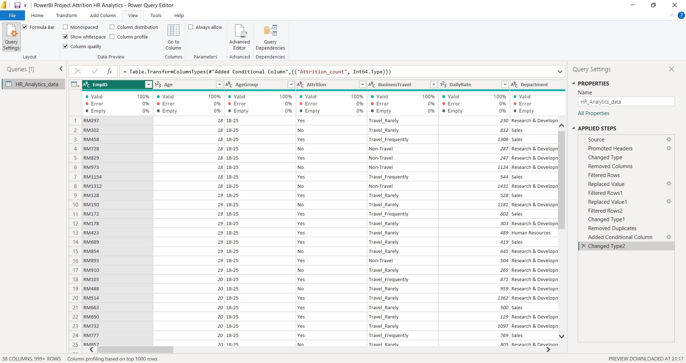
> Ordering the column in assending order 
> we get all the null values at the top 
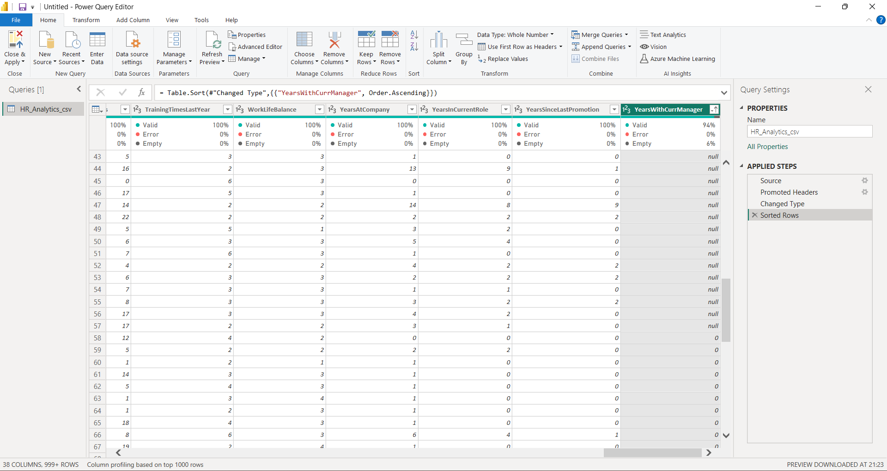
>Now removing top rows by Remove Rows > Remove Top Rows
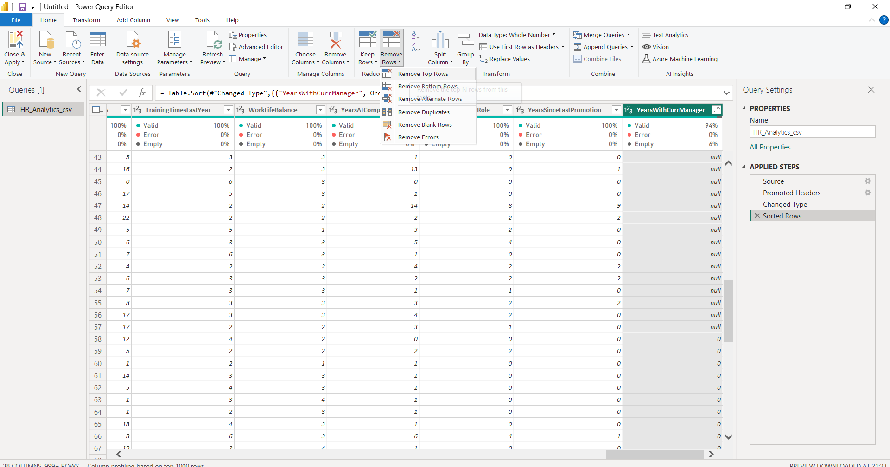

2. Finding Dupplicates
> Removing Duplicate values 
> Group by > Grouping by distinct value
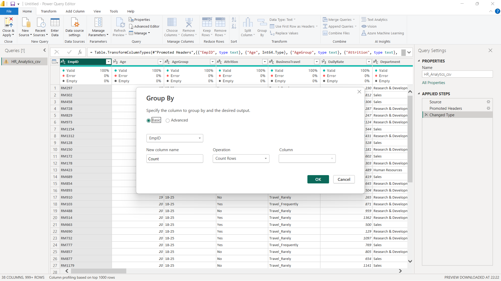
>Filter will show 2
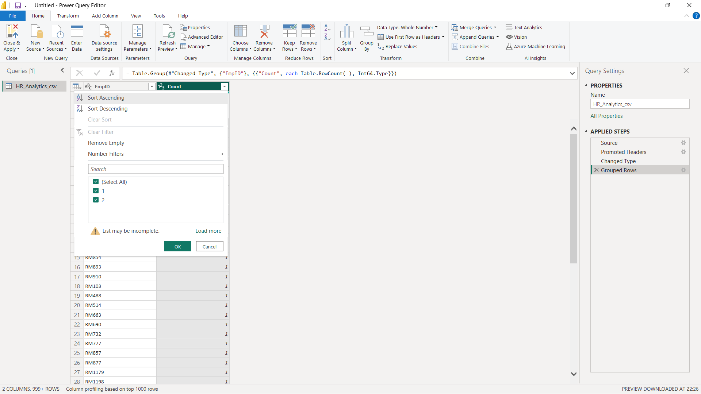
>Selecting all the columns and removing the duplicates
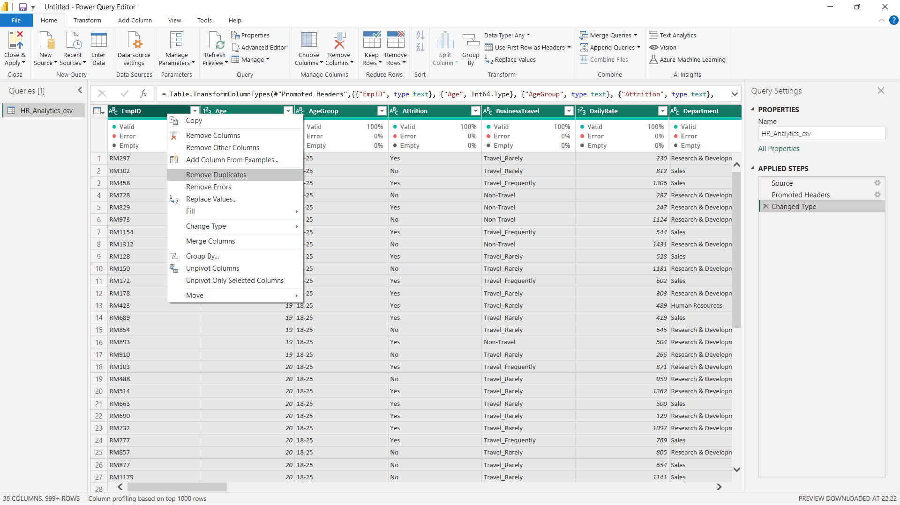

3. Correcting Misc Errors
> Misc Case : We replace the error 
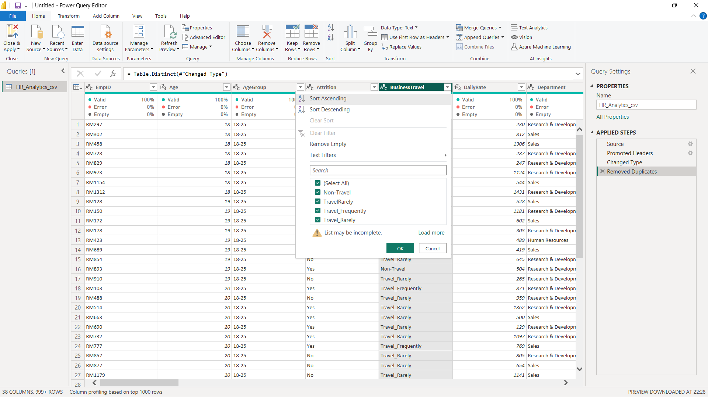
> Data Type Correction by Detect Data Type
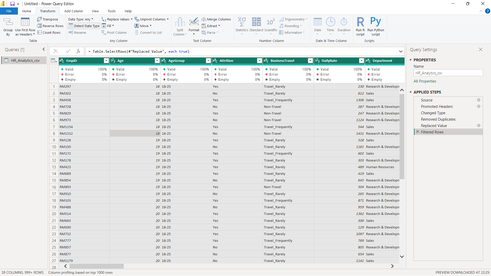

4. Creating Dashboard
> HR_Analytics_Dashboard
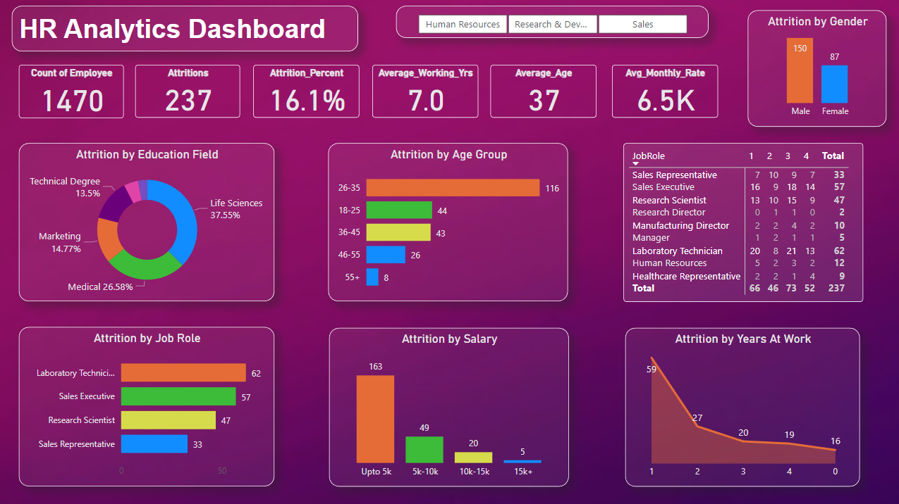

> HR_Analytics_Dashboard for Human Resource Department 
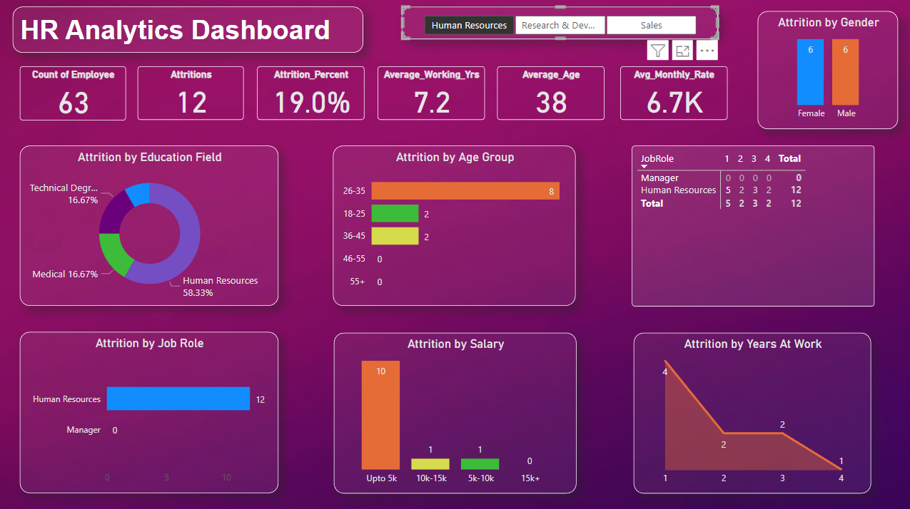

> HR_Analytics_Dashboard for Research and Development 
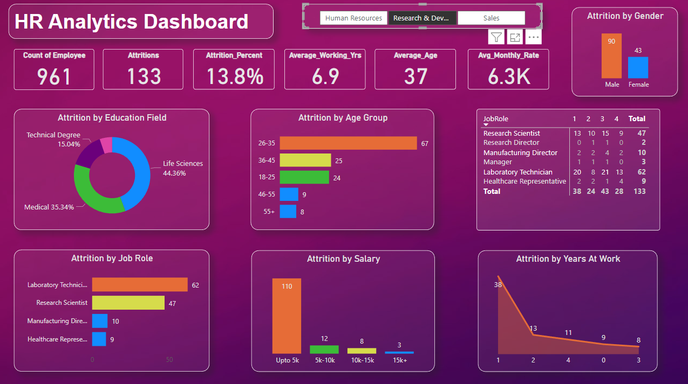

> HR_Analytics_Dashboard for Sales
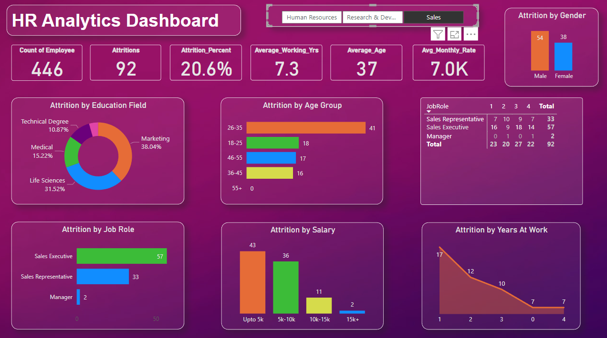

