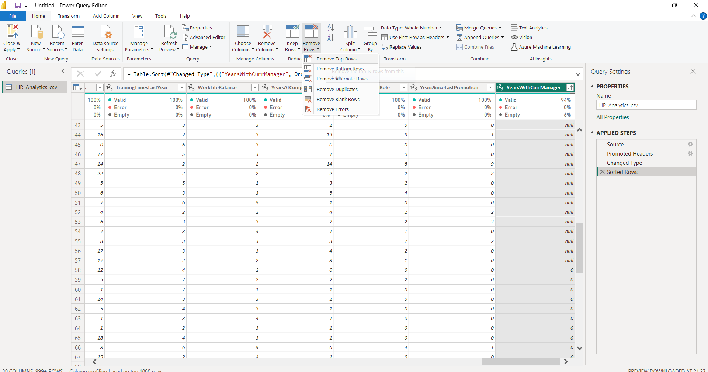
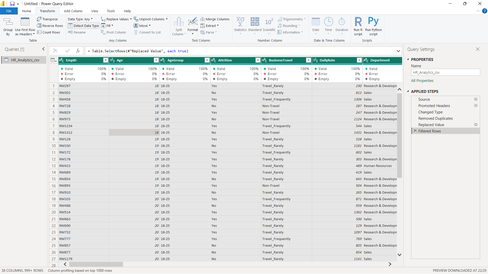

# Power-BI-Project_HR_Analytics

#Objective:

The organization seeks support in the creation of an HR Analytics dashboard to address the challenge of enhancing employee performance and bolstering employee retention, thereby mitigating attrition rates. The problem statement entails identifying viable solutions to be integrated into the dashboard, empowering the organization to extract valuable insights from data and make informed decisions. By leveraging these insights, the organization aims to cultivate a conducive environment for employee engagement and satisfaction, ultimately fostering a higher degree of employee retention.

#Solution:

The solution involves creating an HR Analytics dashboard to consolidate employee performance and retention metrics. By leveraging advanced analytics techniques, the dashboard will provide actionable insights for data-driven decision-making, enabling the organization to improve employee performance and retention effectively.

#Procedures
Step 1:- 
Determining KPI(Key Performance Indicators) which we obtain by analysing and uderstanding the problem and its objective.

Step 2:-

The project involves identifying relevant trends by utilizing Pivot Tables for data analysis. This approach helps extract key insights and patterns from the data efficiently.
(However if using a csv file note that you cannot make pivots as it doesnt allow multiple sheets)

We obtain trends which reflects relevant and important insights according to the project.

Step 3:- 
DATA CLEANING AND PROCESSING
We use PowerQuery of Power BI for this

Transform Data

1. Finding Void Entries
 Home > Column Quality

Ordering the column in assending order 
we get all the null values at the top 

Now removing top rows by Remove Rows > Remove Top Rows

2. Finding Dupplicates
Removing Duplicate values 
Group by > Grouping by distinct value

Filter will show 2

Selecting all the columns and removing the duplicates

3. Correcting Misc Errors
Misc Case : We replace the error 

Data Type Correction by Detect Data Type

4. Creating Dashboard
HR_Analytics_Dashboard

HR_Analytics_Dashboard for Human Resource Department 

HR_Analytics_Dashboard for Research and Development 

HR_Analytics_Dashboard for Sales

